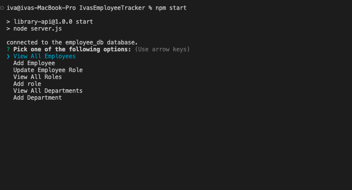

# IvasEmployeeTracker

# IvasTeamProfileGenerator

## Description

### This application helps you track your employees. You are able to view and update employee salary, department, and roles. Use this to keep up to date with all your employees information and stay on top of your operational costs. View all Roles, employees, departments at a glance and keep track of your team. 

## How to use this application

### In the command line run npm start to start tracking your employees!
